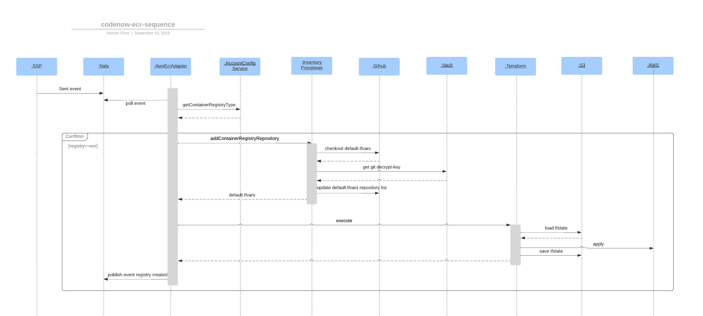

# codenow-aws-ecr-adapter

### Description

Component react on NATS scm.*.component.registered event. For the newly registered component it check if ECR is enabled for given account. If so, aws-ecr-adapter write new container registry repository into default.tfvars in customer space git repository and
 execute Terraform apply to provide the ECR into AWS. After that event about ok/nok ECR creation is emitted. 




### Project structure

`./cmd/` - main go function     
`./configs/` - Benthos configuration and pipeline definition  
`./dev/` - resources for local (docker-compose) development and mocking   
`./processor/` - custom Benthos processor implementation   
`./terraform/` - Terraform resources files definition  
`./docker-compose.yaml` - docker compose for local development, mocking and testing  
`./Dockerfile` - Dockerfile for binary go build a runtime image creation

### Build

- local
In root folder of this project run:

`docker build -t aws-ecr-adapter -f Dockerfile .`

- cloud  
trigger CODENOW  building pipeline

### Local DEV

- fill AWS_S3_ACCESS_KEY_ID and AWS_S3_SECRET_ACCESS_KEY env variables in docker-compose.yaml to connecet tarreform to S3 state storage.  


- build image lovally as shown above  


- in root project directory:
```
docker compose up 
```

- to run nats sandbox run:
```
docker run --rm -it -v dev/nats/nats_nkey:/tmp/nats/nats_nkey natsio/nats-box:latest
```
- and inside the sandbox container publish message to nats subject:
```
nats pub -s nats://host.docker.internal:4222 scm.test.component.created '{"tenantName":"test","applicationName":"test-application","componentName":"test-component","owner":"romisek","personalSpace":true,"type":"xxx","sshUrl": "ss","httpUrl":"string"}' -H Access-Token:xxx --nkey /tmp/nats/nats_nkey
```

- also you can listen for result event:  
```
nats sub -s nats://host.docker.internal:4222 ecr.created  --nkey /tmp/nats/nats_nkey
```

### Deploy  

TODO 